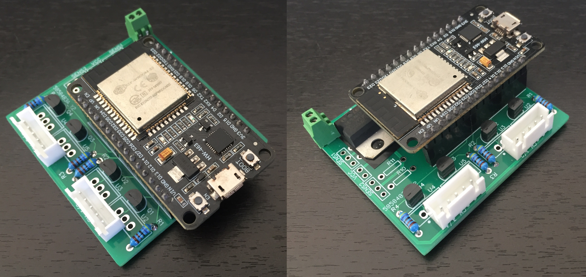

# ESP32 MOSFET shield
Universal 4 channel MOSFET driver shield for nodeMCU ESP32 devkit 1 board. It allows to control up to 4 \~12v appliances using ESP32 board with support for onboard voltage regulator, 2 external sensor inputs, onboard voltage output, 3 push buttons and exposed right handed ESP32 pins. Typical use cases: led light strips, exhaust fans etc.

*ESP32 MOSFET shield with components*

> For schematic and circuit layout refer to easyEDA project (`/easyEDA`) 

## Features
- 4 channel MOSFET driver in either TO-220 or TO-92 packages
- Onboard voltage regulator (TO-220)
- 2x 3 pin input for optional external sensors
- 1x VCC output (same as input)
- 3x optional push buttons on backside for physical control 
- Pull-up/down resistors for MOSFETs, sensors and buttons
- Exposed right hand pins of nodeMCU ESP32 devkit 1 board

## Notices
- Max rated current of \~1A (depending of copper layer thickness) for 12v circuit.
- The hole spacing for ESP32 pins and resistors is bit off.

## Fabrication
- Easiest way is to use PCB fabrication services such as PCBWay or JLCPCB and using the provided Gerber files located in `/Gerber` folder.
- If you wish to modify the design, then you may use the easyEDA project files instead (located in `/easyEDA` folder).